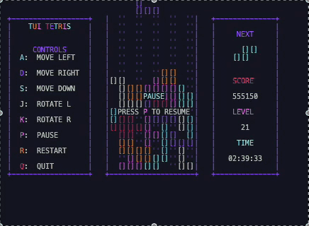
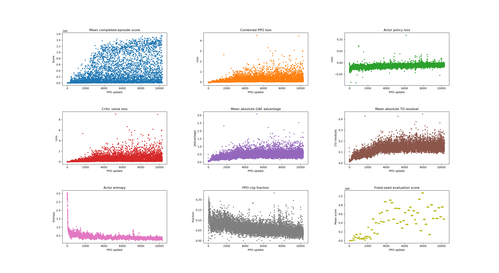

# Tetris RL

A from-scratch Tetris engine for comparing different ways to make decisions:
random play, hand-built and genetically tuned heuristics, linear temporal-
difference learning, Double DQN, and PPO. Every method sees the same board and
chooses from the same set of legal final placements.



[Watch the 15-second gameplay clip as an MP4](assets/ppo-gameplay.mp4)

## Where the project stands

> **Not completely done yet, but I think its enough to show off for now. Mostly jsut need to get my hands on some more compute**




*One in-progress PPO run. The fixed-seed evaluation points and completed-game
scores show the policy learning useful play, but this figure is not a
cross-method benchmark.*


| Method | What it does | Current status |
| --- | --- | --- |
| Random | Chooses a legal placement uniformly | Baseline ready |
| Heuristic | Scores five board features by hand | Playable |
| Genetic heuristic | Evolves the heuristic weights in tournaments | Training and playback ready |
| Linear TD | Learns weights over the same board features | Training ready |
| Double DQN | Learns afterstate values with replay and a target network | Training, resume, evaluation, and playback ready |
| PPO | Learns a placement policy and state-value critic with GAE | End-to-end pipeline ready; more tuning planned |

The important engineering boundary is that policies do not own the game.
`core/` owns the rules, `agents/placements.py` generates candidate afterstates,
and each policy only decides which candidate to use. That keeps the experiment
surface understandable and makes saved DQN and PPO models usable by the same
player CLI.

## Quick start

Requires Python 3.10 or newer.

```bash
git clone https://github.com/CarsonStantonSharpless/Tetris_RL.git
cd Tetris_RL
python3 -m venv .venv
source .venv/bin/activate
python3 -m pip install -r requirements.txt
```

Start with the hand-built heuristic:

```bash
python3 run.py --policy heuristic
```

Or run a fast headless episode:

```bash
python3 run.py --policy heuristic --no-display \
  --instant-placement --max-ticks 1000 --seed 0
```

`python3 run.py --help` lists the policy, placement, display, seed, and model
options. With no arguments the player uses the random policy and BFS placer.

## Training the methods

Generated models, checkpoints, metrics, and plots are written under `runs/`.
That directory is intentionally ignored by Git because a serious training run
can produce gigabytes of resumable checkpoints.

### Genetic heuristic

```bash
python3 -m training.genetic.run_tournament 10 100 \
  --filepath leaders.json --seed 0
```

The tournament evaluates episodes in parallel by default, then writes its
captain and lieutenant weights to JSON. Play the winner with:

```bash
python3 run.py --policy genetic-heuristic --params-file leaders.json
```

### Linear TD

```bash
python3 -m training.reinforcement.run_linear_td 1000 \
  --batch-size 8 --workers 8 --no-display
```

This is the smallest learned baseline: it updates weights over the same five
features used by the heuristic policy.

### Double DQN

```bash
python3 -m training.reinforcement.run_double_dqn 10000 --no-display
```

Double DQN scores the legal placement afterstates with a compact convolutional
network. It uses replay, a separate target network, fixed-seed evaluation, and
resumable checkpoints. An optional heuristic gate can limit every training,
bootstrap, evaluation, and playback decision to the top K hand-ranked moves:

```bash
python3 -m training.reinforcement.run_double_dqn 10000 \
  --heuristic-top-k 8 --no-display
```

### PPO

```bash
python3 -m training.reinforcement.run_ppo 10000 --no-display
```

PPO uses a shared actor-critic network. The actor produces a categorical policy
over the legal placements, while the critic estimates the value of the current
board. By default the trainer collects 1,024 fresh placement transitions,
computes generalized advantage estimates without crossing game boundaries,
and then performs clipped policy updates.

PPO learns from the base line-clear values (40, 100, 300, or 1,200 points)
rather than the engine's level-multiplied display score. This gives the critic a
consistent target scale across long games; plots and evaluations still report
the official game score.

There is also an optional, deliberately small potential-based hint that favors
low boards with open headroom:

```bash
python3 -m training.reinforcement.run_ppo 10000 \
  --bottom-up-bias 0.5 --no-display
```

It is off by default. I plan to revisit PPO's rollout size, entropy behavior,
reward scaling, and the heuristic gate once I have enough compute for a proper
multi-seed sweep.

## Checkpoints and playback

DQN and PPO runs write three kinds of artifacts:

- `model.pt`: the most recent lightweight, playable model
- `best_model.pt`: the best model seen by fixed-seed evaluation
- `latest.pt` and `checkpoints/`: full state for resuming training

Play a saved PPO actor greedily through the terminal UI:

```bash
python3 run.py --policy ppo \
  --params-file runs/ppo_.../best_model.pt
```

For a fast headless evaluation-style run:

```bash
python3 run.py --policy ppo \
  --params-file runs/ppo_.../best_model.pt \
  --no-display --instant-placement --max-ticks 1000 --seed 0
```

Resume training from a full checkpoint:

```bash
python3 -m training.reinforcement.run_ppo 5000 \
  --resume-from runs/ppo_.../latest.pt --no-display
```

The same pattern works for Double DQN. If a model was trained with
`--heuristic-top-k`, use the same value for playback so the action space stays
consistent.

## Controls

Add `--interactive` to allow movement keys alongside an automated policy.
Pause, restart, and quit remain available without it.

| Key | Action |
| --- | --- |
| `A` / `D` | Move left / right |
| `S` | Soft drop |
| `J` / `K` | Rotate left / right |
| `P` | Pause or resume |
| `R` | Restart |
| `Q` | Quit |

## Project map

```text
run.py                  player command-line entry point
core/                   board, pieces, scoring, and engine rules
agents/                 policies, placement search, and player control
training/evaluation/    seeded serial and parallel episode evaluation
training/genetic/       genetic tournament and population code
training/reinforcement/ linear TD, Double DQN, and PPO trainers
storage/                game, parameter, model, and checkpoint formats
visualization/          board and training plots
tui/                    curses terminal renderer
tests/                  focused PPO and GAE tests
assets/                 portfolio-ready gameplay and training visuals
```

## Roadmap before calling it finished

- Run every method against the same held-out seeds and placement budget.
- Repeat the learned methods across multiple training seeds and report spread.
- Tune PPO from evidence rather than one-off runs.
- Publish a compact benchmark table and selected lightweight checkpoints.
- Expand automated coverage beyond the current PPO/GAE tests.

The screenshots in this README are a progress report from one PPO run, not a
claim that PPO has already won the comparison.
